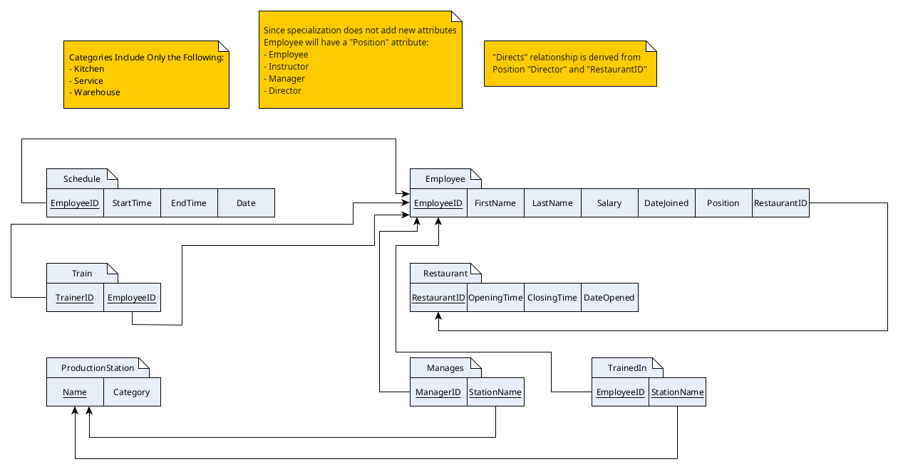

# Team DVA: MySQL DB Restaurant Client
---
## Project Overview
Team DVA was formed to create a client and database around a custom idea for SDT 305: Database Systems. Team DVA chose to create a database schema around a restaurant, as one of the team members has experience working at one.

The project itself consists of a Java Client and a MySQL server. While the server is not shipped with the client itself, any user with technical know-how could set one up. The project provides SQL files for creating the database schema. Additionally, dummy data and suggested user structure is provided in other SQL files.

Here is a relational diagram of the database schema:

The project can be found at its [GitHub repository](https://github.com/ViceroyFaust/SDT305-TeamDVA-Project).

---
## Technologies Used
- Java 21 JDK
	-  Used for developing the project. The JRE can be used for running the software
- Log4J2 v2.24.3
	- Used as our logging system
- MySQL Connector for Java 8.0.33
	- A Java driver for MySQL
- Gradle 8.10 and compatible versions
	- Java Build tool which greatly simplifies project set-up, compilation, and deployment
- MySQL DB 8+
	- The database to which the client connects

---
## Running the Software
### The Client
Download the latest release from the [GitHub repository](https://github.com/ViceroyFaust/SDT305-TeamDVA-Project) . You can use either the compiled binary JAR file or build from source code yourself.
#### JAR
Since this is a command-line program, simply run the pre-built jar-file from the terminal emulator provided with your system:

`$ java -jar DVA-Database-Client.jar `

In case of errors, use the [Building and Running from Source](#Building%20and%20Running%20from%20Source) steps instead. 
#### Building and Running from Source
Since the project uses the Gradle build system, compiling and running is trivial. On Unix-based systems, run the provided `gradlew` wrapper. On Windows, use `gradlew.bat`.

`$ ./gradlew run --console plain`

The above command will automatically install all required dependencies to build the project. It will then build the Java files and run the program. It will then use a "plain" console to make it easier to interface with the program.

Alternatively, build and package the application with a JAR file.

`$ ./gradlew fatJar`

This command will create a JAR file that you will be able to run more reliably than letting the build system run the program for you. Once the above command has finished executing, go to the `build/libs` directory, which will contain the jar-file. Simply run it as you would in the [JAR](#JAR) section.
### The DB Server 
Explaining how to run the database server is beyond the scope of this documentation. However, this manual will provide general steps and suggestions.

To install and run MySQL please refer to the official [MySQL Website](https://www.mysql.com/) or their official [Docker Repository](https://hub.docker.com/_/mysql/).

Once the server is configured and is up and running, you should execute `CREATE DATABASE <database name>;` and then `USE <database name>;` to create the database that you will use. Then, you can use the SQL files provided in the repository for populating the database:
- `creation.sql`
	- Creates the database schema
- `insertion.sql`
	- Populates the database schema with dummy data
- `create_roles.sql`
	- Creates suggested roles and users with access permissions. Recommended that you change the default passwords and usernames. Also disables remote root login.

---
## Implemented Security Considerations
### Input Validation (client side)
While the initial project had some input validation already, upon review we discovered several instances of poor validation, which allowed for malicious input to the server.

- `HandleDQL.java`
	- Several query methods accepted a list of comma separated integers without validation: `getEmployees()`, `getEmployeeStations()`, `getInstructorStudents()`, `getManagersStations()`, and `getEmployeeSchedule()`. We fixed this by implementing a `validateCommaSeparatedIntegers(request)` which validates the input using a regex string.
	- All requests use prepared statements to avoid SQL injection.
	- Empty input is caught and reported rather than executed.
- `HandleDML.java`
	- Due to inexperience, one of our former teammates implemented every method without the use of prepared statements in this class. This opened up our project to SQL injections, in especially sensitive queries that modify data. Prepared statements work by sending the "code" of the query first and the "data" afterwards, thus preventing data-code mixing that allows SQL injections to happen.
	- Added `validateMap()` method to validate multi-prompt data - it should not be empty.
	- The three DML methods `addEmployee()`, `addProductionStation`, and `updateManager()` now validate their multi-prompt input with `validateMap()`. Additionally, all of the SQL queries have been rewritten to use prepared statements to prevent injection. 

Following our fixes, the client catches both malicious data input and improper input and notifies the user that such input is disallowed.
### Authentication and Authorization (server side)
In the original submission of the project, Team DVA used the 'root' user of the SQL server. However, that unnecessarily exposes the inner workings of the server to the client and the outside web.

After reviewing the server configuration, our team settled on the following:
- Remove the ability to connect to root from outside of localhost, thus preventing outside actors from gaining access to it.
- Create distinct roles with specific permissions:
	- employee
		- Only has read access to the database.
	- trainer
		- Has read access to the database.
		- Can modify the 'Train' relation, as they are responsible for training.
	- manager
		- Has read access to the database
		- Has read-write access to 'Schedule', 'Manages', and 'TrainedIn', as those relations fall within their area of responsibility.
	- director
		- Has read access to the database
		- Has read-write access to 'Schedule', 'Train', 'ProductionStation', 'Employee', 'Manages', and 'TrainedIn', as those relations fall within their area of responsibility.
None of the new roles allow the users to access anything outside of the 'restaurant' database, thus preventing security leaks. Additionally, while director has a broad set of permissions, they are not allowed to modify 'Restaurant', as that can only be modified by the developers - the root user.
### Logging (client side)
Initially, this project did not use any kind of logging, besides the info dumped to the terminal for the user to interact with.

Following our review, our team added Log4J2 logging features to our application. Since the client itself is console-based, the logging is done to a separate file under the `logs/` directory. The logger logs important actions within the business logic of the program, such as connecting to or disconnecting from the database, and logs errors such as invalid input.

This logging enabled the developers to quickly identify where an error might have occurred in the code. Furthermore, it allows the user to see detailed information on why the application might have failed to connect to a server. Or, a company could be able to see if any of their users tried to escalate privilege from an unprivileged company computer.

---
Document Version: 2025-05-06
Copyright: Danylo Rybchynskyi & Vladyslav Shvets
